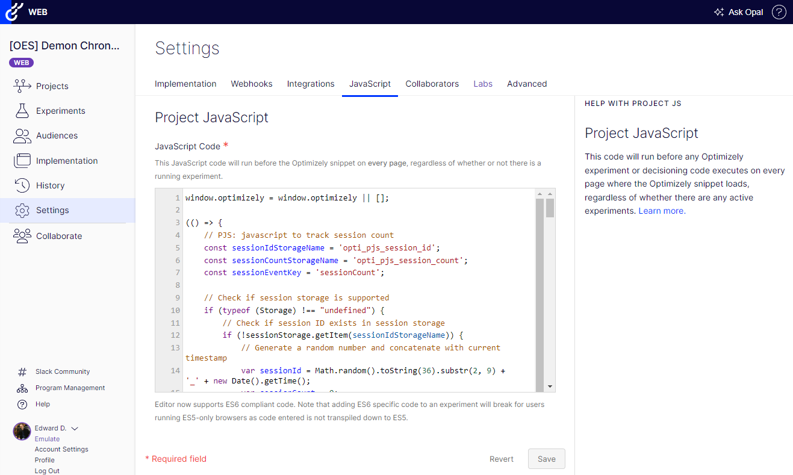

# Optimizely Web Experimentation - Project Js

A collection of useful javascript code to use in Optimizley Web Experimentation project js.

  

This repository contains javascript for the following functionality:
* **Allowed Domain Check** enable/disable Optimizely Web Experimentation based on a configurable list of urls.
* **Disallowed User Agent Check** enable/disable Optimizely Web Experimentation based on a configurable list of user agents.
* **One Trust Consent** enable/disable or hold/send events based on OneTrust cookie consent.
* **Scroll Tracking** track scroll depth based on custom scrolling events.
* **Session Count Tracking** track visitor session count and send as an Optimizely custom event.
* **Visitor Type Segmenting** provide visitor type segmentation in test results by pushing a custom attribute for "New" or "Returning" visitors.
* **6Sense Integration** parses the 6Sense local storage object to populate custom attributes, allowing the ability to create audiences that target 6Sense values.
