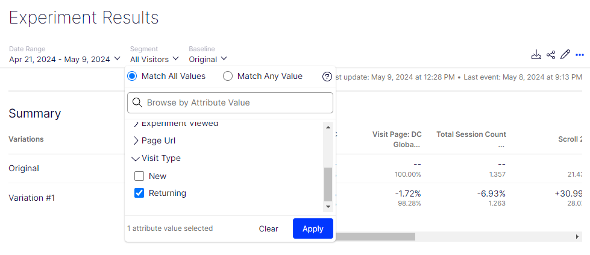

# Visitor Type Segmenting

Populate and push a custom attribute for segmenting results by visit type. Attribute will be populated with 'New' or 'Returning' values dependent upon the optimizely.get('visitor').first_session value.

  

### To use
1. Navigate to **Audiences** and select the **Attributes** tab.
2. Click on **Create New Attribute** and select **Custom Attribute**.
3. Create the new custom attribute and click **Save**:

    

        
    

4. Navigate to project settings and click on **Project Js**.
5. Paste the provided javascript into Project Js and click **Save**.
    

        
    

